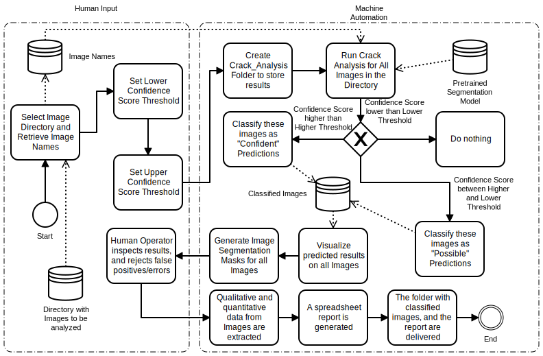

# ABECIS


[](https://forthebadge.com)
[](https://forthebadge.com)

A Free and Open-source **Automated Building Exterior Crack Inspection Software** for Construction and Facility Managers. It works across all platforms (Windows, MacOS and Linux).


This tool has been developed at [S.M.A.R.T. Construction Research Group](https://nyuad.nyu.edu/en/research/faculty-labs-and-projects/smart-construction-research-group.html) at New York University Abu Dhabi, as an extension to our previous conference paper published at [DOI:10.22260/ISARC2021/0086](http://dx.doi.org/10.22260/ISARC2021/0086)


## Installation

> For everything below, if 'python3' does not work, replace 'python3' with 'python'

1. Download [Git](https://git-scm.com/) if you do not have it. And clone this repository using

```
git clone 'https://github.com/Pi-31415/ABECIS'
```

and change working directory with

```
cd ABECIS
```

2. Download Python 3 at [Python Website](https://www.python.org/downloads/), and install.

3. Then, upgrade pip using

```
python3 -m pip install --upgrade pip
```

4. Install torch using

```
pip3 install torch torchvision torchaudio
```

5. Install detectron2, the instance segmentation framework used by ABECIS

```
git clone https://github.com/facebookresearch/detectron2.git
python3 -m pip install -e detectron2
```
You might also need C++ Build Tools on Windows, get it [here](https://visualstudio.microsoft.com/visual-cpp-build-tools/)

If there is any issue with pycocotools, get C++ build tools first, then install with 
```
pip install "git+https://github.com/philferriere/cocoapi.git#egg=pycocotools&subdirectory=PythonAPI"
```


6. Run the python script named **setup.py** using the following command, to set up the dependencies.

```
python3 ./setup.py
```

**[IMPORTANT]** Don't forget to rerun setup.py to install dependencies afterwards.

7. If everything ran smoothly, run ABECIS by

```
python3 ./abecis.py
```

> Note: When running for the first time, it will automatically download the pre-trained model, and will take some time.

## Example Data for Testing

Example data of wall cracks taken in lab using DJI Matrice 300 RTK drone is available [here](https://drive.google.com/drive/folders/1JAcw_7Kw_XL5GmNh1KUp9vH67yRvDQyM?usp=sharing)

## Algorithm



## User Manual

Please follow the steps on the application precisely, and it should be intuitive. A detailed user guide video and documentation is coming soon.

## Contact
Please contact <pk2269@nyu.edu> for any issues regarding this software.
